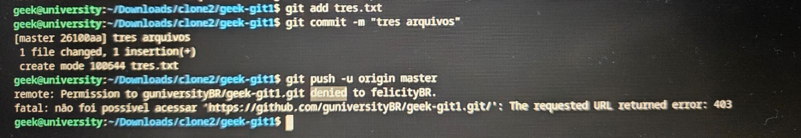

# Nome do seu Projeto
> Um resumo curto sobre o que seu projeto faz(1 ou duas linhas).

Um ou dois paragrafos com mais detalhes do que ele faz.


imagem/screenshot sobre o projeto para as pessoas olharem e já terem alguma base sobre o projeto.

## Instalação

OS X & Linux

```
npm instal --save
```

windows:

```
edit autoexec.bat
```

## Exemplo de Uso

Alguns exemplos que motivariam as pessoas a utilizarem seu projeto ou que demonstrasse que este é util para as pessoas, divida em partes menores e se possível coloque algum codigo ou prints de tela.

## Ambiente de desenvolviment

Descrever como instalar e preparar qualquer dependencia de desenvolviemnto para que seu projeto possa ser executado localmente e pessoas possam contribuir com mesmo, se possivel fornessa informações para multiplataforma.

## Historico de atualizações.

* 0.2.1
    * CHANGE: Atualização de docuemntação
* 0.2.0
    * CHANGE: Removida a função `setPadrãoXYZ()`
    * ADD: Adicionado a função `inicializar()`
* 0.1.1
    * FIX: Crash quando executada `escrever()`
* 0.1.0
    * O primeiro lançamento estavel
    * CHANGE: Renomeado de `Projeto XYZ` para `PROJETO AVC`
* 0.0.1
    * Projeto Inicial.

## Meta

Seu nome - [@SeuTwitter](https://twitter.com.br) - seuemail@gmail.com.br


Distribuido sobre a licença. Veja `Licença` para mais informações.


[https://github.com/seuusuario/seuprojeto]
[https://github.com/seuusuario]